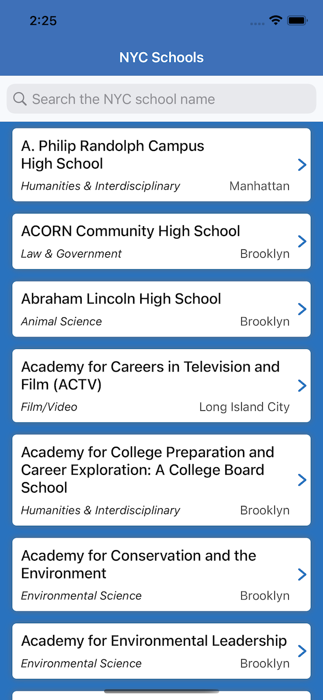
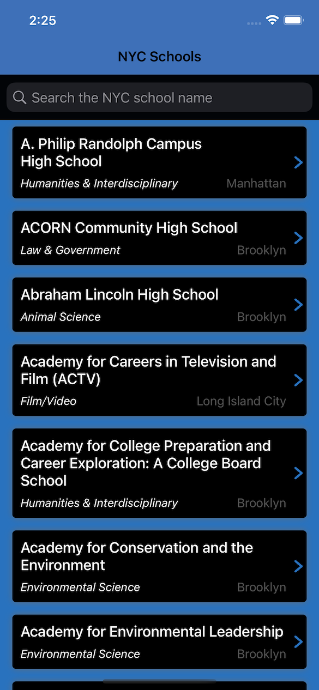
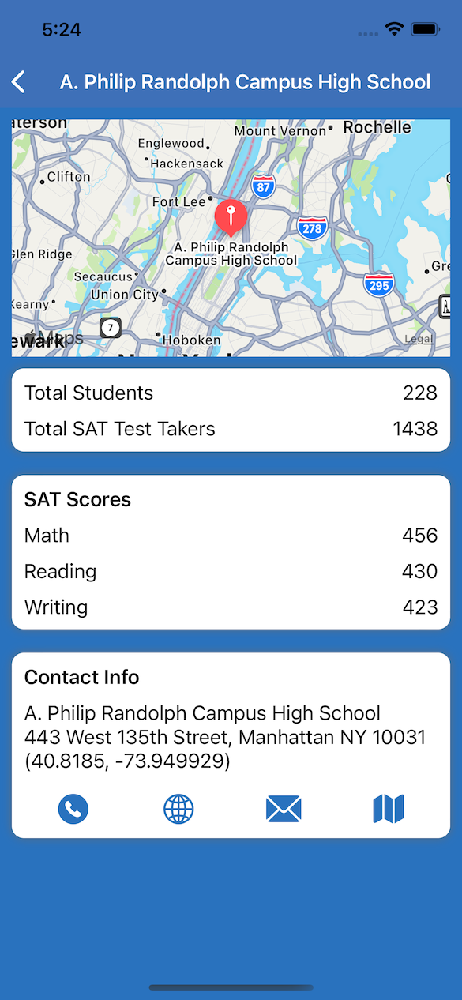
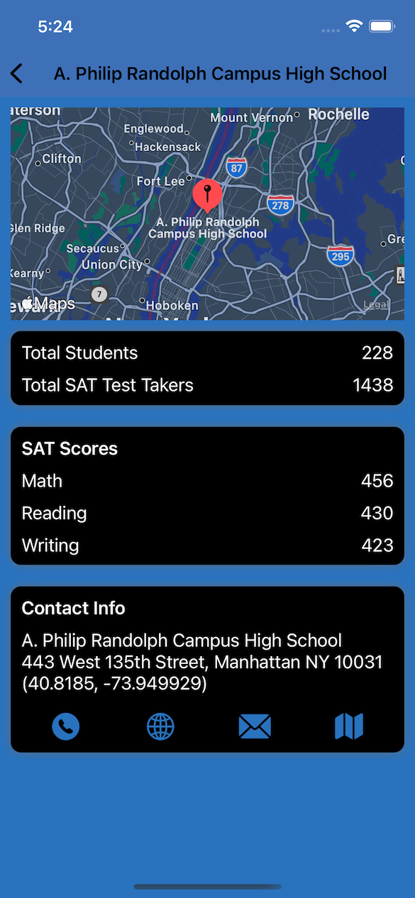

# New York City Schools 

## Description

The NYC School app is built with MVVM architecture and dependancy injection with Simple UI.

## Features

* Display sorting by school name
* Search schools by school name
* Pull to refresh data 
* Details of School with SAT scores and total number of students test taken
* Fetching and Viewing School details
* Open location in Google maps through deep linking, call and email options
* Support both light and dark mode
* Network handling with dependancy injection and reachablity check
* Supports both Portrait and Landscape
* Unit test coverage 

**Home Screen:**

|||
|:----------------------------:|:------------------------:|
|Home Light Mode| Home Dark Mode |

**Details Screen:**

|||
|:----------------------------:|:------------------------:|
|Details Light Mode| Details Dark Mode |

**Flow :**

||
|:----------------------------:|
|Flow| 

# Installing

No addition steps needed, just build with XCode 13

## Api Source

- [NYC Schools] - https://data.cityofnewyork.us/Education/DOE-High-School-Directory-2017/s3k6-pzi2
- [SAT Scores] - https://data.cityofnewyork.us/Education/SAT-Results/f9bf-2cp4
